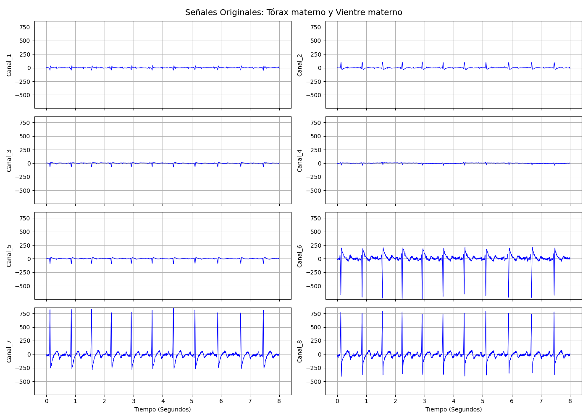

# Práctica U1-1. De bioseñales a características

**Materia / Docente:** Dr. Alejandro Antonio Torres García

Este repositorio contiene la implementación de la **Práctica U1-1**, enfocada en el análisis, preprocesamiento y extracción de características de bioseñales desarrollados en Python. Se encuentra dividida en dos objetivos principales: el procesamiento del Electrocardiograma Fetal (fECG) y el procesamiento y extracción sobre señales de Electromiografía (EMG).

## Resumen del Proyecto

El diagnóstico médico contemporáneo depende fundamentalmente de la adquisición y el análisis de las señales eléctricas generadas por el cuerpo humano. En particular, este proyecto aborda dos bioseñales críticas:
- **Electrocardiograma fetal (fECG):** Una herramienta esencial para el monitoreo del bienestar del feto, pero que presenta el reto técnico de estar fuertemente enmascarada por el electrocardiograma materno (mECG). Para aislar la señal fetal, es necesario implementar técnicas de procesamiento digital como el filtrado adaptativo.
- **Electromiografía de superficie (sEMG):** Empleada para evaluar la actividad eléctrica durante la contracción muscular. Su análisis requiere acondicionamiento y la extracción de características en múltiples dominios (tiempo, frecuencia y tiempo-frecuencia) para maximizar la capacidad de discriminar entre diferentes movimientos musculares.

## Metodología

El análisis experimental se divide en dos etapas principales:

### 1. Preprocesamiento del fECG
Se utilizó un dataset (`newDataset.mat`) con registros combinados materno-fetales de 8 canales (tórax y abdomen). El objetivo fue aislar el fECG mediante la cancelación del mECG utilizando filtrado adaptativo.



Se evaluaron tres algoritmos de respuesta al impulso finito (FIR):
- **LMS (Least Mean Squares)**
- **NLMS (Normalized LMS)**
- **RLS (Recursive Least Squares)**

Se implementó un análisis de correlación de Pearson para seleccionar el par idóneo de canales (primario del vientre y referencia del tórax) y así asegurar la mayor convergencia posible de los filtros.

### 2. Preprocesamiento y Extracción de Características en sEMG
Se analizó el dataset `EMG_SUJETO10` (grabado con pulsera Myo Armband) para distinguir entre la **Clase 2** (Agarre de pinza) y **Clase 3** (Agarre lateral).


El procedimiento consistió en:
- Extraer las instancias de ambas clases correspondientes al Día 1.
- Filtrar utilizando un pasabanda Butterworth (20 Hz - 90 Hz).
- Remuestrear las señales a `N=8192` muestras para formar tensores 3D consistentes.
- Extraer características en:
  - **Dominio del Tiempo:** RMS, MAV, ZC.
  - **Dominio de la Frecuencia:** MNF mediante FFT.
  - **Dominio Tiempo-Frecuencia:** DWT (Wavelet Daubechies 4) y CWT (Wavelet compleja de Morlet `cmor`).

## Resultados

En esta sección se describen los hallazgos principales y su relevancia. Las visualizaciones gráficas completas (señales procesadas, diagramas de caja y espectrogramas) resultantes de este proyecto se encuentran disponibles en la carpeta `resultados`. **(Nota: Aquí no se colocan las imágenes para favorecer la lectura estructurada, por favor, refiérase a los directorios mencionados).**

### Análisis del fECG (Referencia: `resultados/fECG/img`)
Los resultados demuestran que el algoritmo **RLS** fue el más efectivo para la atenuación del ruido materno, logrando una cancelación casi total de la interferencia en comparación con el LMS (reducción parcial) y el NLMS (convergencia errática). El residuo obtenido del RLS permitió distinguir de manera estable una actividad rítmica de alta frecuencia, consistente con los latidos cardíacos fetales.

### Análisis de Señales sEMG (Referencia: `resultados/EMG/img`)
El análisis estadístico demostró que características independientes de dominio temporal (*t12*) y de dominio frecuencial (*f4*) exhiben diferencias estadísticamente significativas ($p < 0.05$) entre la Clase 2 y Clase 3, validando la eficacia del pipeline en el preprocesamiento de características. Estas diferencias distribucionales entre medianas permiten establecer de manera robusta patrones o fronteras entre los movimientos.

## Conclusión

La práctica validó de forma exitosa el uso de filtros adaptativos (destacando la eficacia del algoritmo RLS) para la recuperación de bioseñales de muy baja energía, como el fECG. Asimismo, el pipeline de extracción multidominio automatizado en señales sEMG demostró que las características estadísticas del dominio del tiempo y la frecuencia resultan igual de robustas o más efectivas que el análisis complejo tiempo-frecuencia (DWT/CWT) para establecer una separación y discriminación clara entre diferentes gestos musculares.

## Modo de Uso

### Requisitos Previos

La arquitectura del proyecto ha sido desarrollada bajo un entorno de gestión de dependencias provisto por `uv` (de acuerdo al archivo `pyproject.toml`). Ejecutar con `uv run` garantiza un entorno aislado reproducible con bibliotecas científicas indispensables (`pandas`, `scipy`, `matplotlib`, `seaborn` y `pywavelets`).

### 1. Ejecución de la Parte 1 (Análisis fECG)
Instrucción que carga las señales biológicas, aplica los filtros adaptativos y busca eliminar el ruido materno.

```bash
uv run main_1.py <ruta_a_newDataset.mat>
```

### 2. Ejecución de la Parte 2 (Extracción de Características EMG)
Prepara las señales sEMG mediante filtros pasabanda, remuestreo para homologar la longitud y extracta las características a archivos `.csv`.

```bash
uv run main_2.py <ruta_a_dataset_dia1>
```

### 3. Análisis de Relevancia Estadística
Realiza la prueba estadística (Independent t-Student) para evaluar las diferencias significativas en las instancias y clases procesadas, autogenerando distribuciones tipo boxplot.

```bash
uv run analisis_diferencias.py
```

## Bibliografía

- Agostinelli, A., et al. (2015). Noninvasive fetal electrocardiography: an overview of the signal electrophysiological meaning, recording procedures, and processing techniques. *Annals of Noninvasive Electrocardiology*, 20(4), 303-313.
- De Luca, C. J., et al. (2010). Filtering the surface EMG signal: Movement artifact and baseline noise contamination. *Journal of Biomechanics*, 43(8), 1573-1579.
- Domino, M., et al. (2025). The effect of filtering on signal features of equine sEMG collected during overground locomotion in basic gaits. *Sensors*, 25(10), 2962.
- Hasan, M., et al. (2009). Detection and processing techniques of FECG signal for fetal monitoring. *Biological Procedures Online*, 11, 263-295.
- Hermens, H., et al. (2000). Development of recommendations for SEMG sensors and sensor placement procedures. *Journal of Electromyography and Kinesiology*, 10(5), 361-374.
- Li, X., et al. (2025). Review of non-invasive fetal electrocardiography monitoring techniques. *Sensors*, 25(5), 1412.
- Mallat, S. G. (1989). A theory for multiresolution signal decomposition: the wavelet representation. *IEEE Transactions on Pattern Analysis and Machine Intelligence*, 11(7), 674-693.
- Phinyomark, A., et al. (2012). Feature reduction and selection for EMG signal classification. *Expert Systems with Applications*, 39(8), 7420-7431.
- Phinyomark, A., et al. (2012). The usefulness of mean and median frequencies in electromyography analysis. *IntechOpen*.
- Raez, M., et al. (2006). Techniques of EMG signal analysis: detection, processing, classification and applications. *Biological Procedures Online*, 8, 11-35.
- Rioul, O., & Duhamel, P. (1992). Fast algorithms for discrete and continuous wavelet transforms. *IEEE Transactions on Information Theory*, 38(2), 569-586.
